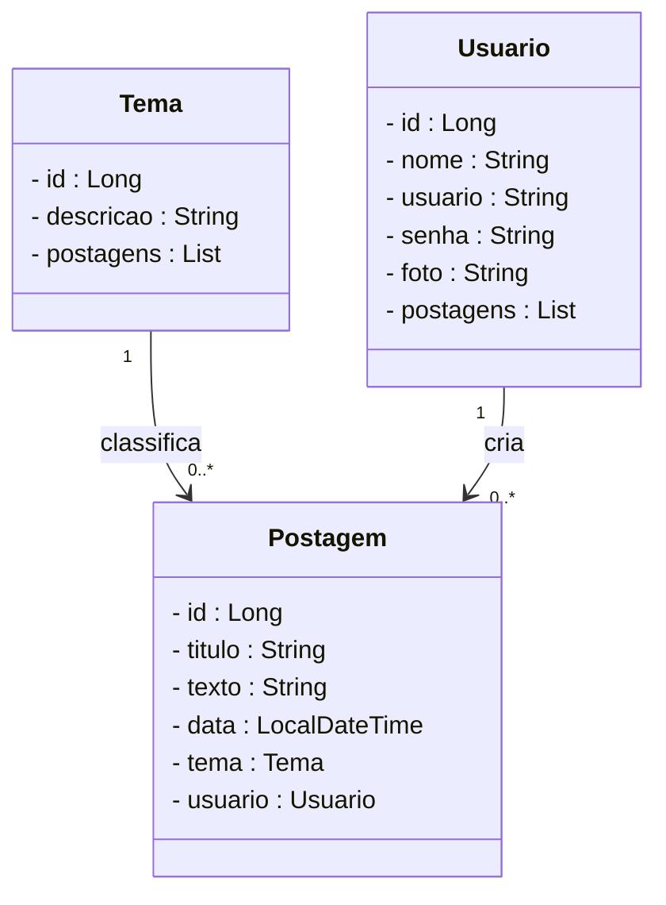
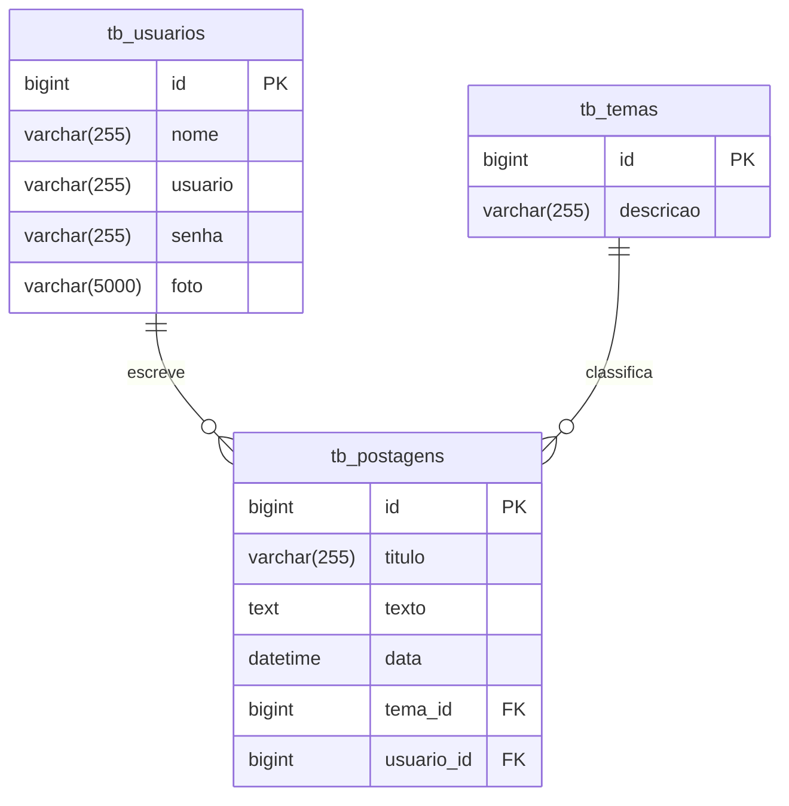

# Projeto Blog Pessoal - Backend com Spring Boot

<div align="center">
 
</div>

## 1. Descrição

O **Blog Pessoal** é uma aplicação que permite que usuários publiquem, editem e visualizem postagens relacionadas a temas variados, de forma organizada e segura. Este projeto foi desenvolvido com fins educacionais, simulando uma aplicação real de blog para praticar conceitos de API REST com Java e Spring Boot.

Entre os principais recursos que um blog pessoal oferece, destacam-se:

1. Criação, edição e exclusão de postagens
2. Associação de postagens a temas específicos
3. Cadastro e autenticação de usuários
4. Visualização de postagens por tema ou usuário
5. Controle de acesso a operações sensíveis

## 2. Sobre esta API

A API do Blog Pessoal foi desenvolvida utilizando **Java** e o **framework Spring**, seguindo os princípios da Arquitetura MVC e REST. Ela oferece endpoints para o gerenciamento dos recursos **Usuário**, **Postagem** e **Tema**, permitindo a interação entre os usuários e os conteúdos publicados.

### 2.1. Principais funcionalidades da API:

1. Consulta, cadastro, login e atualização dos dados de usuários
2. Consulta, criação e gerenciamento de temas para classificar postagens
3. Criação, edição, listagem e remoção de postagens
4. Associação de postagens a temas e autores
5. Autenticação via token JWT para segurança nas requisições

## 3. Diagrama de Classes



## 4. Diagrama Entidade-Relacionamento (DER)



## 5. Tecnologias utilizadas

| Item                          | Descrição       |
| ----------------------------- | --------------- |
| **Servidor**                  | Tomcat          |
| **Linguagem de programação**  | Java            |
| **Framework**                 | Spring Boot     |
| **ORM**                       | JPA + Hibernate |
| **Banco de dados Relacional** | MySQL           |
| **Segurança**                 | Spring Security |
| **Autenticação**              | JWT             |
| **Testes automatizados**      | JUnit           |
| **Documentação**              | SpringDoc       |

## 6. Requisitos

Para executar os códigos localmente, você precisará:

- [Java JDK 17+](https://www.oracle.com/java/technologies/javase/jdk17-archive-downloads.html)
- Banco de dados [MySQL](https://dev.mysql.com/downloads/)
- [STS](https://spring.io/tools)
- [Insomnia](https://insomnia.rest/download) ou [Postman](https://www.postman.com/)

## 7. Como Executar o projeto no STS

### 7.1. Importando o Projeto

```bash
git clone https://github.com/rafaelq80/blogpessoal_spring_t82.git
```

### 7.2. Executando o projeto

1. Na Guia **Boot Dashboard**, localize o **Projeto Blog Pessoal**
2. Clique em **Start or Restart** para iniciar a aplicação
3. Acesse `http://localhost:8080` para abrir o Swagger da API

## 8. Contribuição

Este repositório é parte de um projeto educacional, mas contribuições são sempre bem-vindas! Caso tenha sugestões, correções ou melhorias, fique à vontade para:

- Criar uma **issue**
- Enviar um **pull request**

## 9. Contato

Desenvolvido por [**Eduardo**](https://github.com/EduardoTosta)
Para dúvidas, sugestões ou colaborações, entre em contato via GitHub ou abra uma issue!
